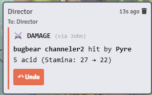

# Draw Steel Quick Strike

A Foundry VTT module that enables collaborative damage application in the Draw Steel system through a secure GM relay mechanism.

## Overview

Foundry, by default, prevents players from applying damage tokens they don't own. This module solves that limitation by:

- Providing a socket-based communication channel for damage requests to tokens they've "targeted"
- Notifcations (via PM) to GM/Director with undo capibilites for damage
- Quick reminders to players if they accidently target themselves for damage. 

## Requirements

 * SocketLib
 * A GM must be logged in

## Settings

The module includes the following configurable settings:

- **Public Damage Log**: When enabled, damage and healing events are posted to public chat for all players to see. Undo buttons remain private to the GM regardless of this setting. Defaults to private (GM-only) messages.

## Stuff I might add (mostly inspired by MIDI QOL)

 - Batch Damage (Multiple Targets Summary)
 - Sound Effects / Annimations - Or likely a seperate mod
 - Damage History Log
 - Additional configuration options